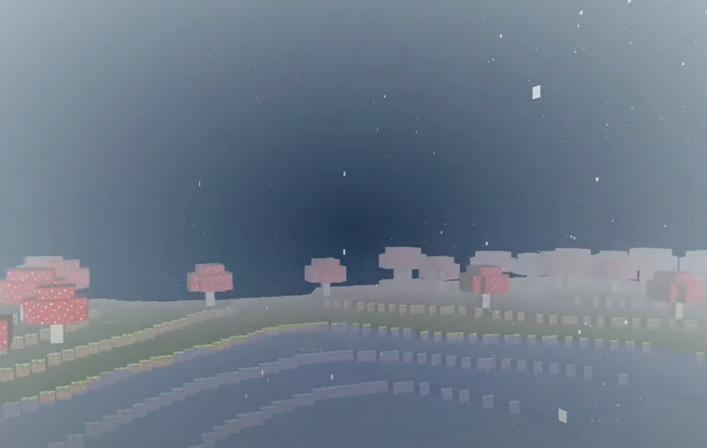

### Player Physics

In this part, I implemented the player's tick function, which include ```processInputs``` and ```computePhysics``` functions. For ```processInputs```, I associate each input keys with  accelerations on each direction, which is fairly easy using Qt's input system. Then for ```computePhysics```, I have fly version and non-fly version. Player's velocity is computed using 

```
m_velocity += glm::normalize(m_forward)    * m_acceleration.z * dT
               + glm::normalize(m_right)   * m_acceleration.x * dT
               + glm::normalize(m_up)      * m_acceleration.y * dT;
``` 

I also implemented delete and create block function, which is done in the moveclick event.Everytime the mouse click, I do a raycast from the camera and check whether it hit something within 3 units. If it does, set that block's type to Empty.

### Efficient Terrain Rendering and Chunking
#### CHUNK:
1. A structure is created that stores vertex positions, and another that stores directions, offsets, and vertices that form a chunk neighbor's face.
2. Make Chunk inherits from Drawable, implements the create() function which iterates over the x, y, z coordinates of the chunk and iterates over the coordinates of the 6 neighboring blocks to check if they are empty. The VBO data is added for each face of each empty neighboring block if the neighboring block is empty.
3. The loadVBO() function is implemented to receive the interleaved vertex data vector as well as the index data vector , and buffer them into VBOs.

#### TERRAIN:
1. Terrain is now generated from a 4x4 Chunk to generate a zone unit. The terrain expands as the player approaches 16 blocks from the edge of a Chunk that is not connected to an existing Chunk.
2. Changed the draw() function when the Chunk inherits from Drawable, so it draws each Chunk with the given ShaderProgram; sets the model matrix to the appropriate X and Z transformations.

#### SHADERPROGRAM:
1. Implemented a second drawing function drawInterleave() for the ShaderProgram class, to render a Drawable with an interleaved VBO set.

### Texture and Texture Animation

I finished the texture pipeline, and also some simple texture animation on water and lava. I also implemented opaque and transparent rendering so that after enabling GL_BLEND all textures are rendered correctly.

### Muti-Thread

I implemented a multi-threaded chunked rendering. First, I locate the player's zone by the current player position, then I compare the player's zone in the previous frame with the zone in this frame to find the chunks that do not need to be rendered, and destroy the vbo data of these chunks. After that, I decide if I need to create chunks for this zone by determining if the zone was created before, and then store these chunks in the newChunkMap if required. By iterating through the newChunkMap, I create a blockTypeWorker for each new chunk and create an additional thread to initialize the block data in the chunk. After initializing the chunk, store it in the blockTypeMap. Iterate through the blockTypeMap, creating a VBOWorker for each chunk and creating an extra thread to initialize the chunk's VBO data. Finally, after loading the VBO data, the chunk binds the VBO data to the GPU uniformly. In addition, a thread mutex is needed for each Map operation.


### Shadow Mapping

This is a very classic method to generating shadows in games. In this project I only implemented a very basic SM, but planning to add PCSS in the future.

Difficulty:
I found it a little difficult to find a correct bias and near/far plan number, so it takes me a long time to adjust in order to create better shadows.


### Weahter, Procedurally placed assets, Water waves, Post-process Camera Overlay, Distance fog

#### Weahter:

I implemented two different weather systems: rain and snow (triggered by the K and L keys in the demo): 


#### Water waves:

I change the position of the water wave vertex Y by the sin function:


#### Post-process Camera Overlay:

1. For Underwater, I change the color of original vertex to blue and applied the sine function to implement the visual effect. (The same as ShaderFun project)
2. For UnderLava, I change the color of orignial vertex to red and increase the color depth by time through. Additionally, I make the visual effect more realistic by Berlin noise function.

##### **Water:**


##### **Lava:**


#### Distance fog:

Pass in the current position of the player through the shaderprogram. Linear interpolation is performed between the original color of each pixel and the color of the fog, depending on the distance of the object from the player.


