### Intro

This project harnesses the power of CUDA-enabled GPU for rapid path tracing, generating high-quality, globally-lit visuals. Path tracing works by sending out rays from the camera. These rays, when they meet reflective or refractive surfaces, keep traveling until they intersect with a light source. Leveraging parallel processing, this method accurately determines the overall light intensity at a specific spot on an object, resulting in a lifelike representation. Incorporating CUDA guarantees peak performance in Physically-based Rendering.


[Github Link](https://github.com/CaballoMa/Project3-CUDA-Path-Tracer)

## Shading Kernel with BSDF Evaluation

### <a name="diffuse">Ideal Diffuse</a>
   
The diffuse BSDF provides a surface with a matte appearance. It uses cosine-weighted sampling at the points where rays intersect the surface to decide the direction of subsequent rays and then evaluates these rays as they emanate from the surface.

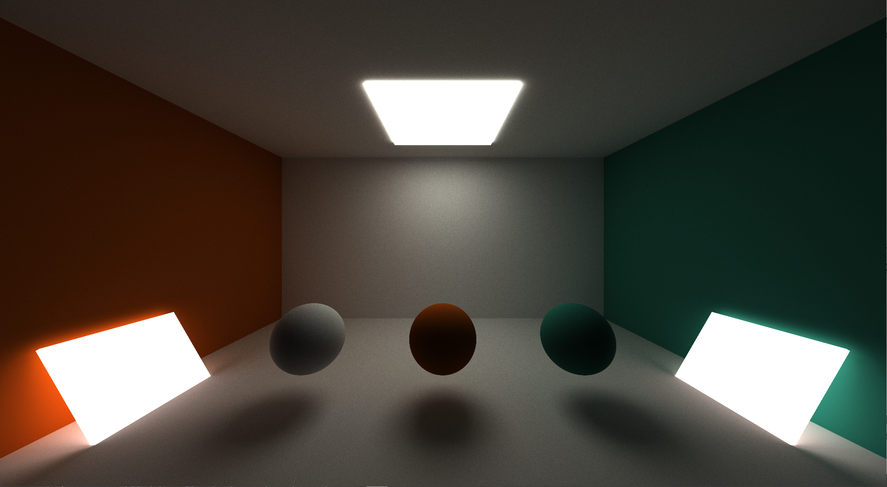

### <a name="perf_specular"> Perfectly Specular Reflective</a>   

A perfectly specular surface reflects rays at the same angle as they arrive, imparting a mirror-like appearance to the surface. The function 'glm::reflect' is utilized to produce this perfectly reflected ray. 

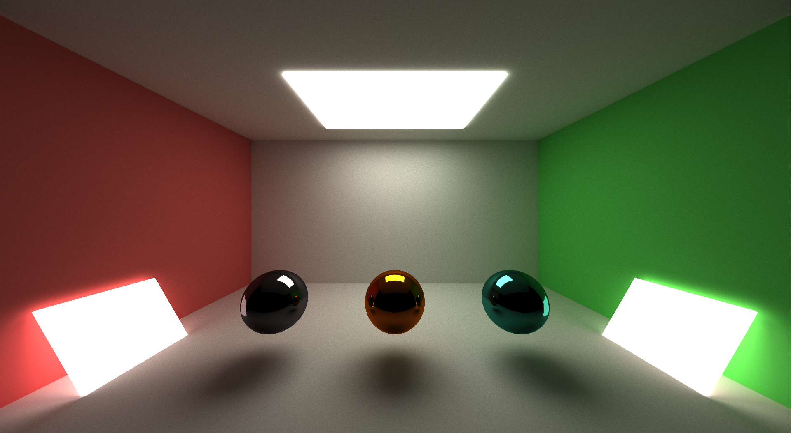


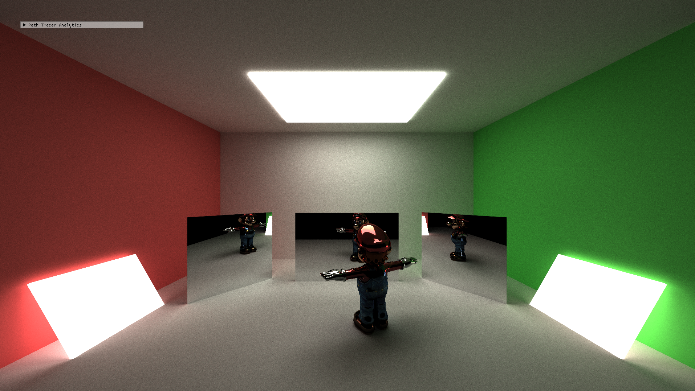

### <a name="imperf-specular">Imperfect Specular Reflective</a>   

In path tracing, both perfect and imperfect specular surfaces are simulated using probability distributions from [GPU Gems 3, Chapter 20](https://developer.nvidia.com/gpugems/gpugems3/part-iii-rendering/chapter-20-gpu-based-importance-sampling). Imperfect surfaces blend perfect specular and diffuse reflections for a more natural metallic look.

|Perfect Specular|IOR 0.3|IOR 0.5|
|---|---|---|
| 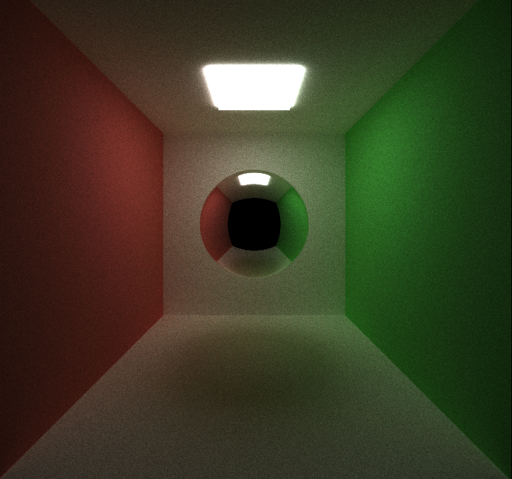|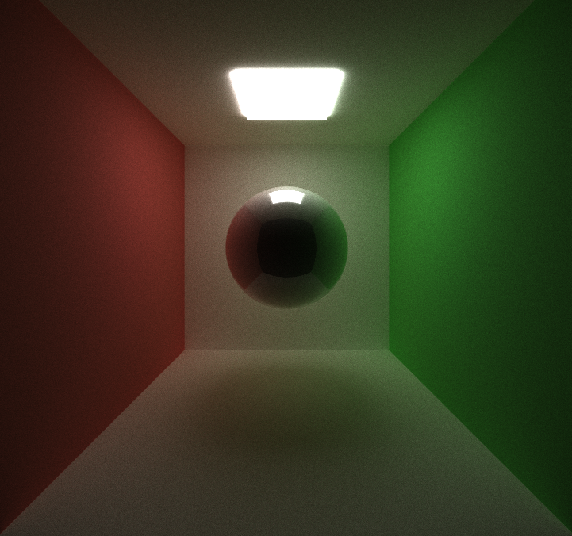 |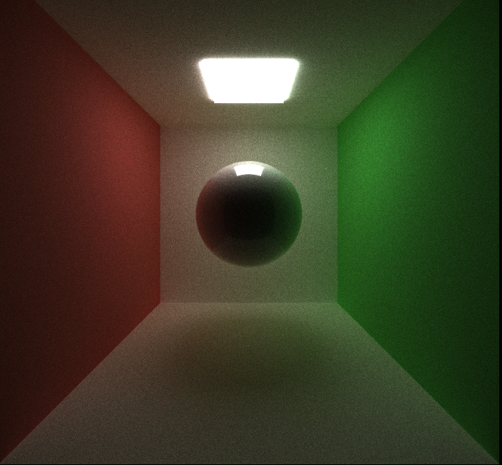

## <a name="stream_compaction_term">Path Termination by Stream Compaction</a>

```
#if STREAM_COMPACTION
	PathSegment* path_end = thrust::stable_partition(thrust::device, dev_paths, dev_paths + num_paths, isPathCompleted());
	num_paths = path_end - dev_paths;
	iterationComplete = (num_paths == 0);
#endif

struct isPathCompleted
{
    __host__ __device__ bool operator()(const PathSegment& pathSegment) {
    	return pathSegment.remainingBounces > 0;
    }
};
```


## <a name="ray_sorting">Sorting Rays</a>

```
#if SORT_MATERIAL
	thrust::sort_by_key(thrust::device, dev_intersections, dev_intersections + num_paths, dev_paths, dev_materialIds());
#endif

struct dev_materialIds
{
    __host__ __device__ bool operator()(const ShadeableIntersection& intersect1, const ShadeableIntersection& intersect2)
    {
    	return intersect1.materialId < intersect2.materialId;
    }
};

```

## <a name="cache">Caching the First Bounce Intersections   </a>

```
#if	CACHE_FIRST_BOUNCE && ! ANTI_ALIASING
	if (iter > 1) {
		cudaMemcpy(dev_intersections, dev_cache_intersections, pixelcount * sizeof(ShadeableIntersection), cudaMemcpyDeviceToDevice);
	}
		
#endif
	computeIntersections << <numblocksPathSegmentTracing, blockSize1d >> > (
		depth
		, num_paths
		, dev_paths
		, dev_geoms
		, hst_scene->geoms.size()
		, dev_intersections
		, dev_triangles
		, dev_bvh_nodes
		);

#if CACHE_FIRST_BOUNCE && ! ANTI_ALIASING
	if (iter == 1)
	{
		cudaMemcpy(dev_cache_intersections, dev_intersections,
			pixelcount * sizeof(ShadeableIntersection), cudaMemcpyDeviceToDevice);
	}
#endif

```

## <a name="refract">Refraction</a>
The images utilize Schlick's approximation to achieve refraction effects. The results incorporate the function glm::refract, based on Snell's law, to determine the direction of the refracted ray.  
 
|IOR 1.33|IOR 1.77|IOR 2.42|
|---|---|---|
| 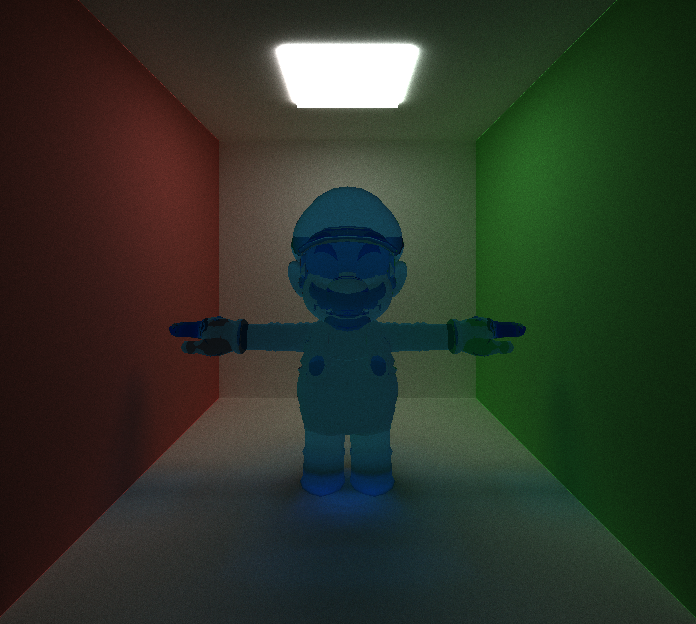|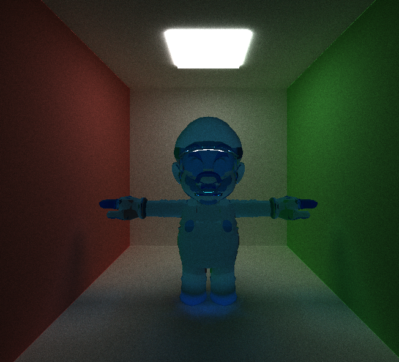 |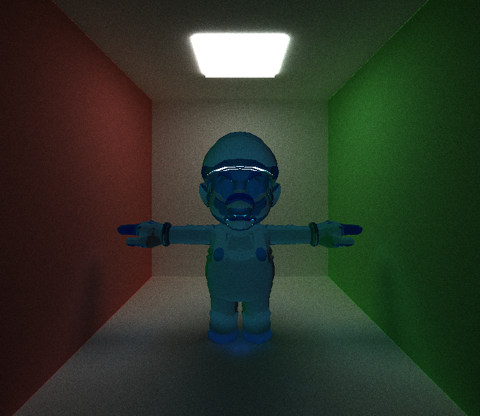

## <a name="dof">Depth of Field</a>
In path tracing, Depth of Field is achieved by jittering rays within an aperture, mirroring the real-world function of a lens. This introduces noise to rays that strike objects at the focal length, resulting in a blurry effect. According to [PBRT 6.2.3](https://pbr-book.org/3ed-2018/Camera_Models/Projective_Camera_Models): 


## <a name="ssaa">Stochastic Sampled Anti-aliasing</a>

|Without Antialiasing| With Antialiasing|
|---|--|
|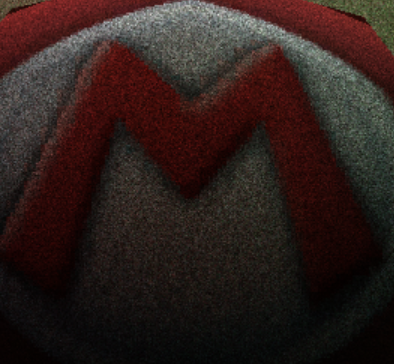 |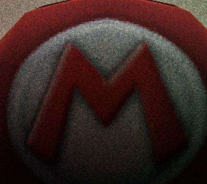 | 

## <a name="mesh">Obj & Mesh Loading</a>
Utilizing the [tinyObjLoader](https://github.com/tinyobjloader/tinyobjloader), it parses the .obj file's data to assemble scene triangles using vertex, face, normal, and texture information. Before rendering the mesh through ray-triangle intersections, it first performs bounding volume intersection culling by examining rays against a volume encompassing the entire mesh.     
<p align="center">
  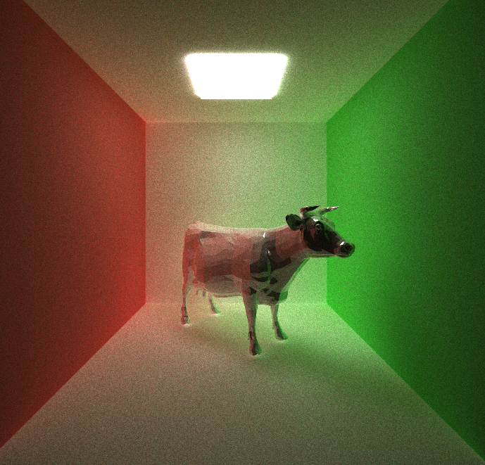
</p> 

<p align="center">
  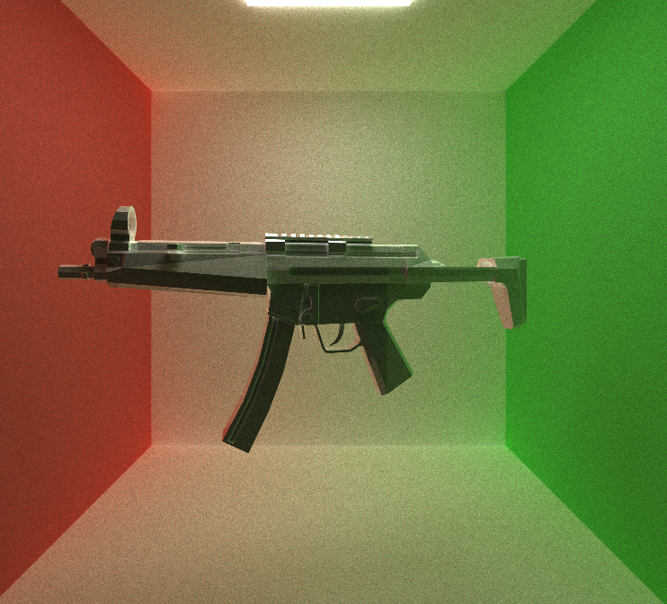
</p> 

## <a name="texture">Texture mapping & Procedural texture </a>


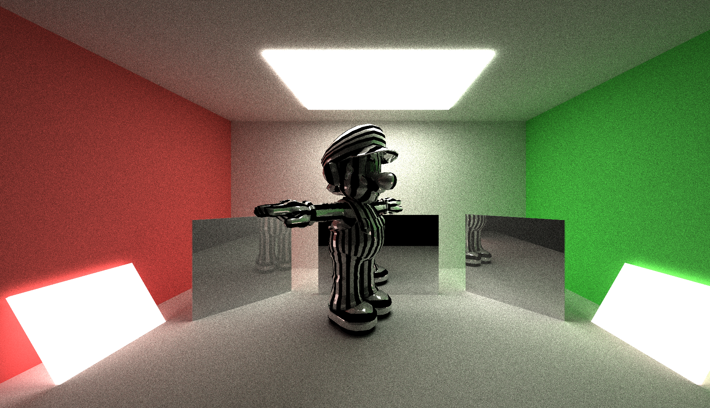

## <a name="directlighting">Direct Lighting</a>

|Without the Direct Light|Direct Light in the last bounce|Direct Light in penultimate bounce|
|---|---|---|
|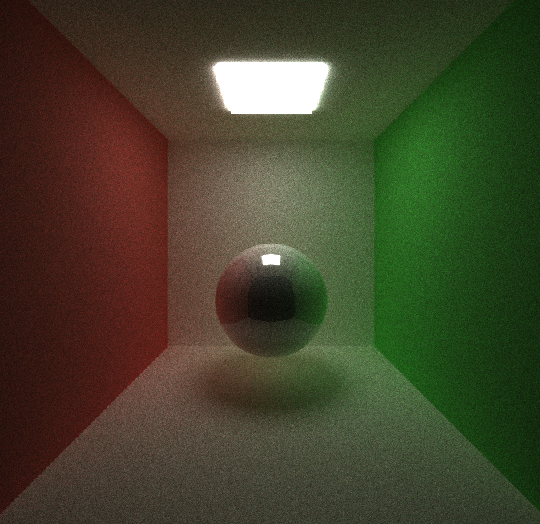 |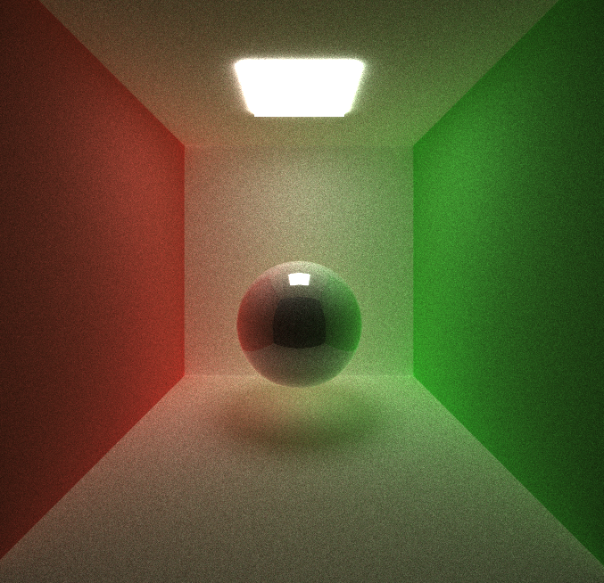 |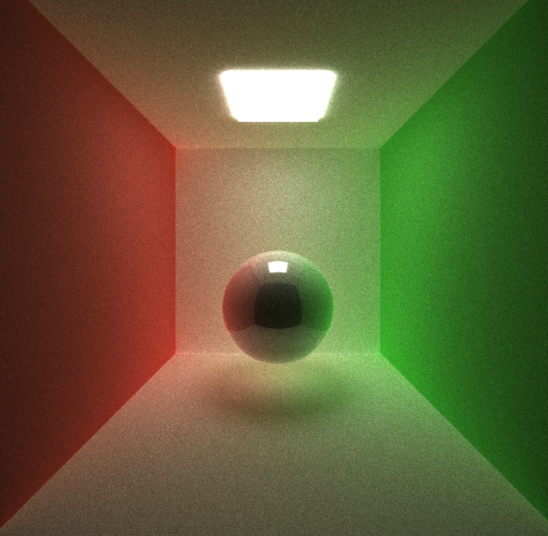

## <a name="bssrdf">Subsurface scattering </a>

|BSSRDF without Texture|BSSRDF with Texture|
|---|---|
|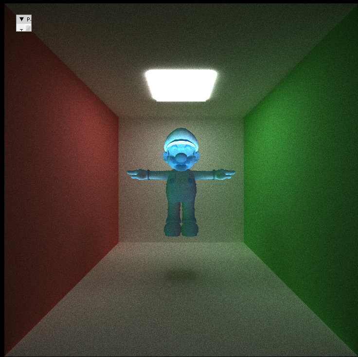|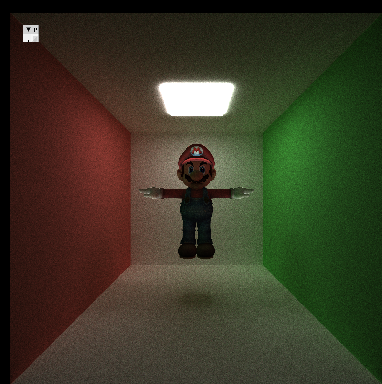|


## <a name="bvh">Bounding Volume Hierarchy </a>

In path tracing, accurately determining attributes like surface normal, and ray's distance necessitates intersection with the scene's geometry. While basic engines might test intersections with every scene primitive, this becomes inefficient with detailed meshes.

To enhance efficiency, the Bounding Volume Hierarchy (BVH) is used. This structure, formed of Axis Aligned Bounding Boxes (AABBs), simplifies ray-scene intersections. Rather than rays intersecting each triangle, they engage with BVH nodes. Only after a parent node registers a hit does its child node undergo evaluation. This reduces the costly triangle intersection tests to only when an AABB in a leaf node is hit.
