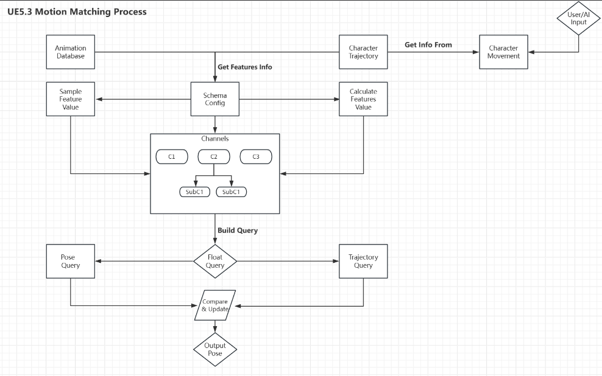
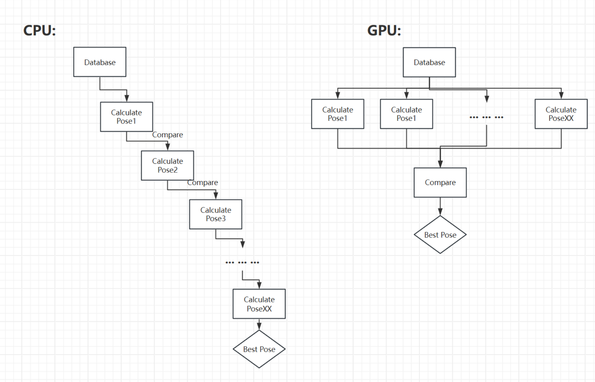
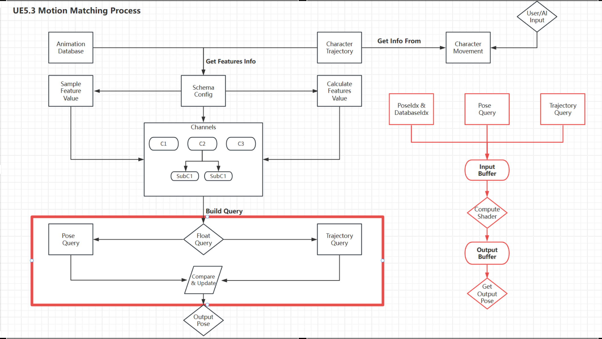
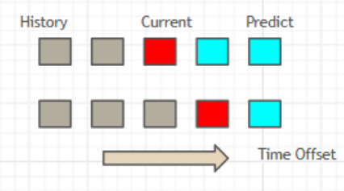
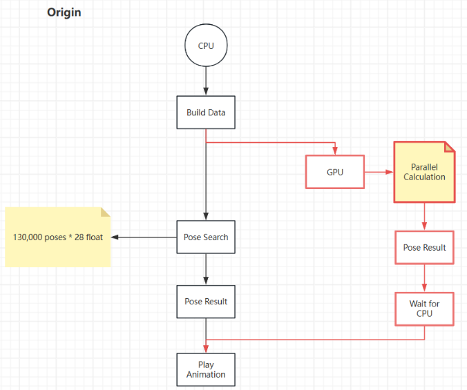
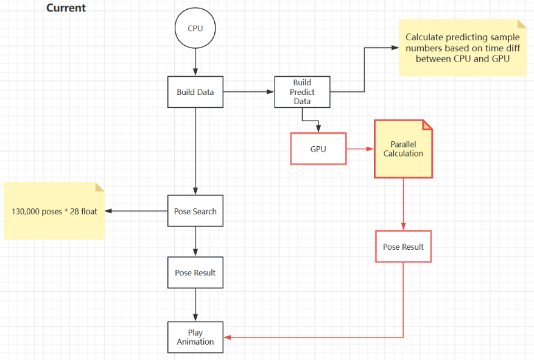
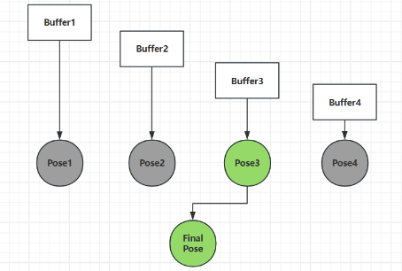
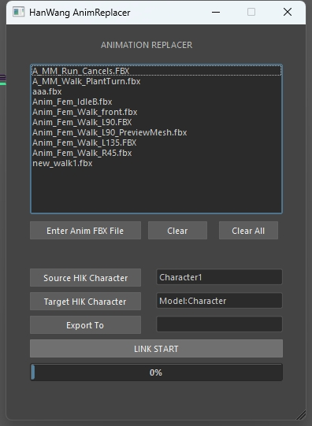
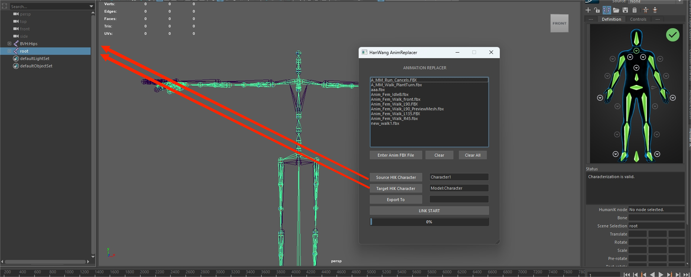

### Intro

Traditional Motion matching is CPU-based, and usually only runs on the main character. Our approach uses a GPU-based method to speed up the process and make it more suitable for multi-character motion-matching conditions.

Also, traditional Motionmatching is just to make the character animation look more fluent, but we think that pose match can be used to do personalized animation, that is, a character can choose different types of animation according to the current state, which can make the NPCs in our game more vivid and interesting.

## Overview Output

  

  

[Github Link](https://github.com/CaballoMa/GPUBased_Emotional_MotionMatching)

## UE5.3 Motion Matching Process Framework

  

## Our Working Flow

  

The red box is the part we optimize with GPU compute shader, we put the database data and trajectory data into the buffer to the gpu, and compare the compute shader result in the cpu to get the best pose.

  

we put the database data and trajectory data into the buffer to the gpu, and compare the compute shader result in the cpu to get the best pose.

#### Further frame prediction

If we don't wait for the cpu it will cause the gpu's Output to lag behind the animation of the current frame, so it needs to be calculated from data sampled in the future to reduce the lag error.

  

**Original Solution:** 

  

**Current Solution:**

  

#### 5. Time dimension denoize

Also, to reduce dispatch stress, we distribute each dispatch into four buffer and apply prediction on each of them.

  

**Result for prediction denoize: **

  

As you can see, the character animation without predicting is inconsistent, and you can see that the character's footsteps repeat and cross over. The right one with prediction implement works fine.

### Database building support

Since we need to have different databases for our characters, a big problem shows up: we don't have this much animation data. Additionally, most of the data we get can not fit our skeleton. Thus, we need to use MAYA human IK to retarget them. However, there are hundreds of animation data for each database, it is even impossible to manually retarget the animation. Thus, we wrote a Maya plugin to solve this large-scale retarget problem.

  

  

