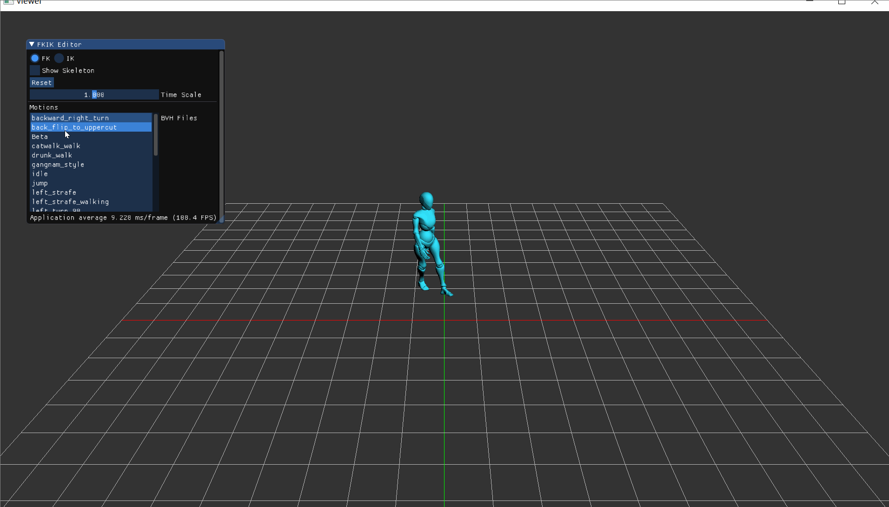
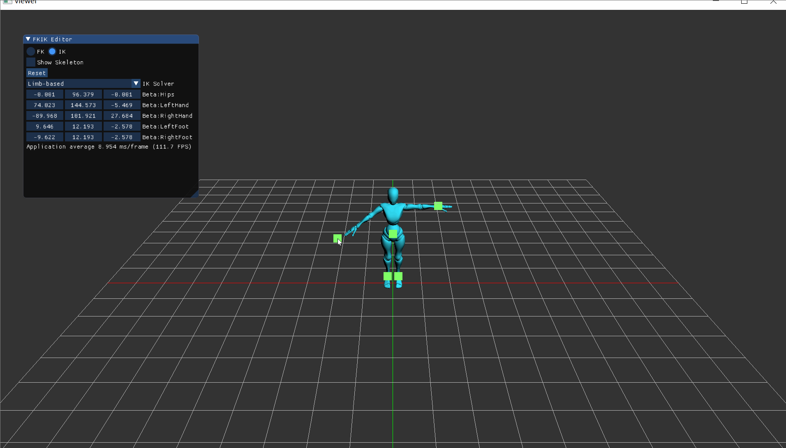

## Intro

A dynamic library Unity plugin leveraging C++ to provide advanced animation capabilities.Implemented robust FK/IK systems,bone and mesh binding, enhancing realistic bone movement in animations.

## Feature
* Robust FK/IK systems
* Limb-based IK
* CCD IK

## Result

### FK

  

### Limb-based IK

  

### CCD IK

  

