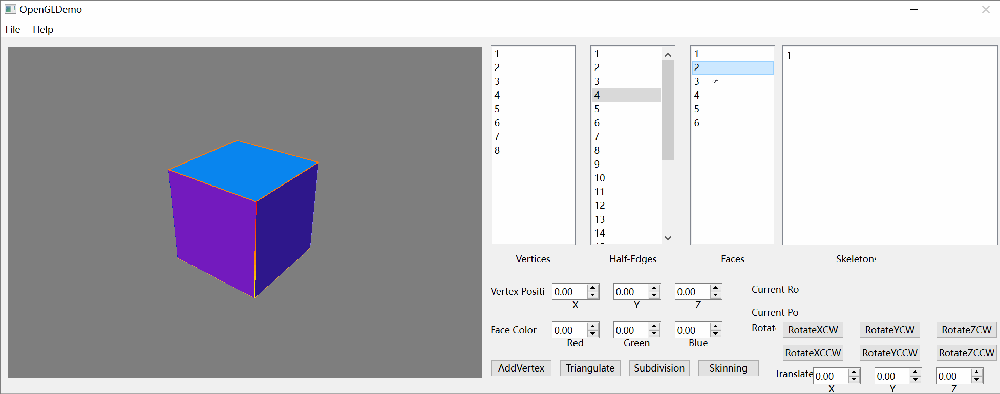
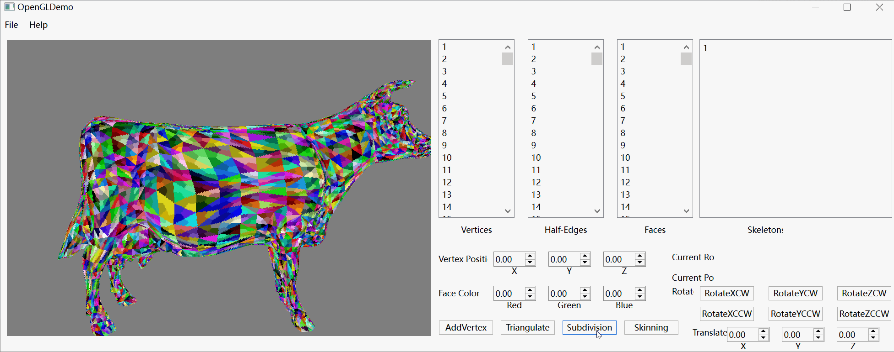
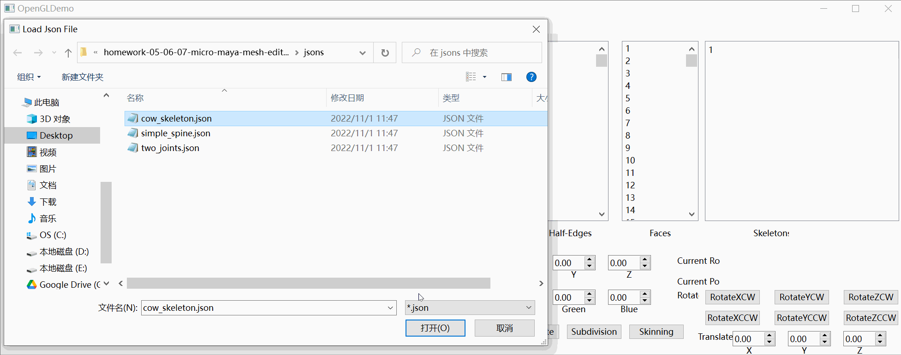

### Intro

In this project, I built a mirco Maya from scratch with C++ and OpenGL in QT Creator. The final version includes basic functions including:

* Mesh manipulation
* Catmull-Clark subdivision
* Skeleton and skinning
* Object loading

A final user interface based on QT GUI is shown below. 

[Github Link](https://github.com/CaballoMa/Mini-Maya)

### Vertex & Edge & Mesh Selection:

  

### Subdivision:

  

### Skinning:

  

