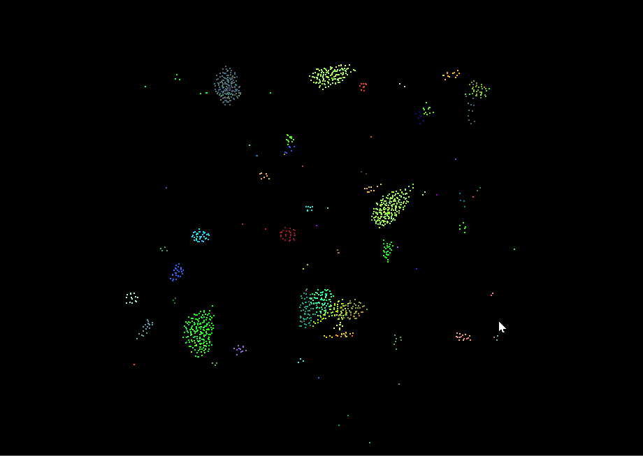
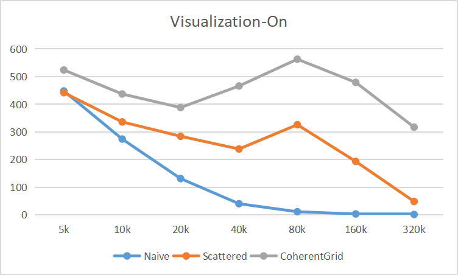
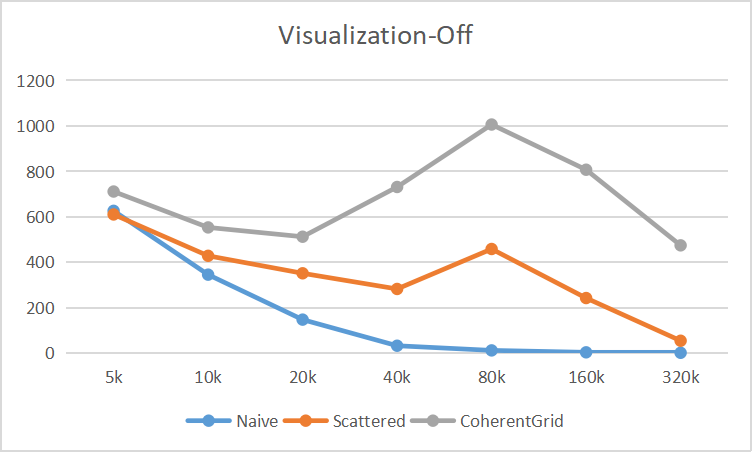
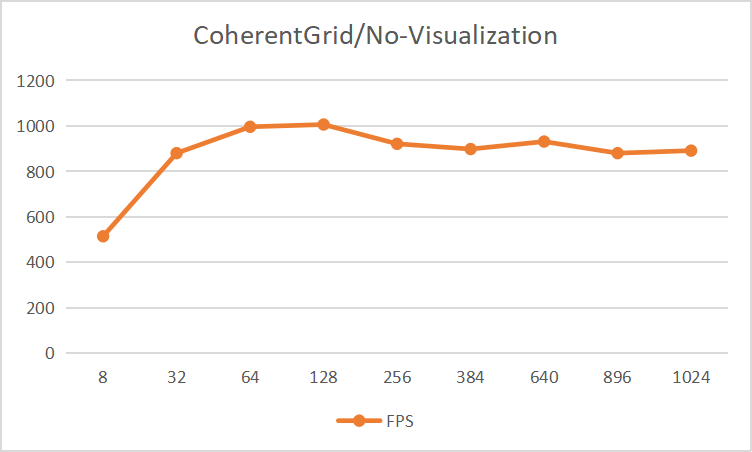
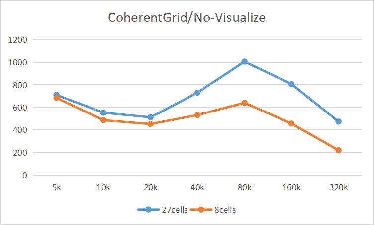

### Intro

In this project, I implemented a flocking simulation based on the Reynolds Boids algorithm, along with two levels of optimization: a uniform grid, and a uniform grid with semi-coherent memory access.

[Github Link](https://github.com/CaballoMa/Project1-CUDA-Flocking)

### Showcase

* 5k boids (naive) 

  

* 20k boids (naive)

  

* 100k boids (coherent)

  

### Performance Analysis
* Average Frame Rate & Number of Boids (Visualization-On)

  

* Average Frame Rate & Number of Boids (Visualization-Off)

  

* Average Frame Rate & Block Size (Coherent Grid, 80k boids, visualization-Off)

  

* Average Frame Rate & 8 vs 27 Cells (Visualization-Off)

  

